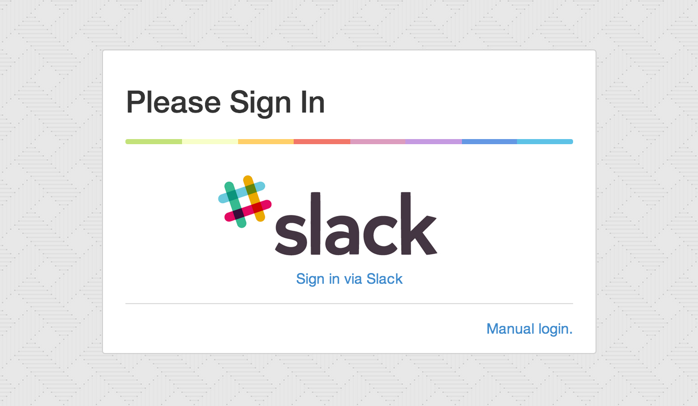

slack_auth_proxy
=================


A reverse proxy that provides authentication via your Slack.com Team (Based on [google_auth_proxy](https://github.com/bitly/google_auth_proxy))

[](https://travis-ci.org/tappleby/slack_auth_proxy)


## Architecture

```
    _____________         ________________         ______________
    |Nginx/Apache| ----> |slack_auth_proxy| ----> |upstream 1...N| 
    -------------         ----------------         --------------
                                ||
                                \/
                         [slack oauth2 api]
```


## Installation

1. [Install Go](http://golang.org/doc/install)
2. Clone the project
3. Build: `go get . && go build`
4. Run the executable: `./slack_auth_proxy`

## OAuth Configuration

You will need to register an OAuth application with slack, and configure it with Redirect URI(s) for the domain you
intend to run slack_auth_proxy on.

1. Visit Slack's API portal https://api.slack.com/applications
2. Select an existing application or choose "Create a new application"
3. Edit the application settings, and list the Redirect URI(s) where you will run your application. For example: 
`https://internalapp.yourcompany.com/oauth2/callback`
4. Make a note of the Client ID, and Client Secret and specify those in the configuration file.

Currently Slack does not have an easy way to retrieve the Team ID. For now:

1. Visit `auth.test` testing page https://api.slack.com/methods/auth.test/test
2. Select the token for team you wish to authenticate against. And Hit "Go"
3. In the JSON response box, find `team_id`. Add this value to the configuration file. eg: T12345


## Configuration

Configuration for slack_auth_proxy is specified via a yaml configuration file, the default path is `config.yml`

Example config file:

	# Slack settings
	client_id: XXXXXXXXXXXXXXXXXXXXXXXXXXXXXXXXX
	client_secret: XXXXXXXXXXXXXXXXXXXXXXXXXXXXXXXXX
	slack_team: XXXXXXXXX

	# These keys can be generated by using: ./slack_auth_proxy --keys
	cookie_hash_key:
	cookie_block_key:

	upstreams:
	  - host: "http://127.0.0.1:8080/"

	  # Uncomment to restrict users that have access.
	  #  users:
	  #    - johndoe


## Endpoint Documentation

Slack auth proxy responds directly to the following endpoints. All other endpoints will be authenticated.

* /oauth2/sign_in - the login page, which also doubles as a sign out page (it clears cookies)
* /oauth2/start - a URL that will redirect to start the oauth cycle
* /oauth2/callback - the URL used at the end of the oauth cycle

## Future plans

- Add support for groups.
- Manage the proxy via slack commands.

## Preview

